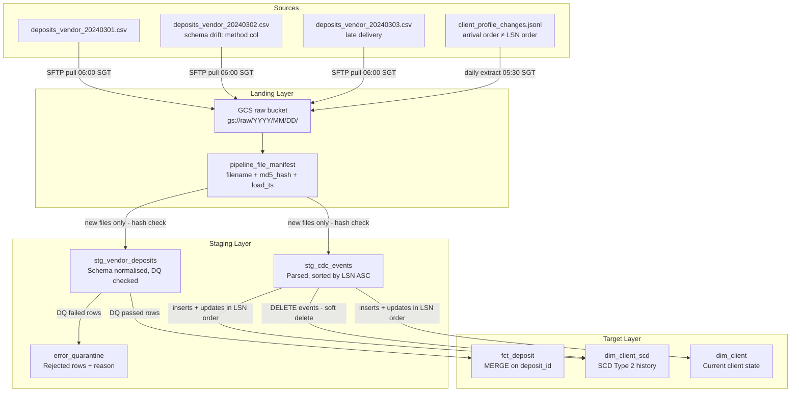

# Part 1 — Pipeline Design, Data Quality & Reconciliation

---

## 1a. Pipeline Design Document

### 1. Architecture Overview

The pipeline ingests two new source types into the trading warehouse: daily vendor CSV deposit files and a CDC JSONL change-log from the operational database.



#### Layer responsibilities

| Layer | Purpose |
|-------|---------|
| **Landing** | Raw files stored in GCS exactly as delivered — no transformation. Every file registered in `pipeline_file_manifest` keyed on `(filename, md5_content_hash)`. Immutable audit record of what arrived and when. |
| **Staging** | Schema normalisation (e.g. `method` → `payment_method` from day 2 file), DQ checks applied, LSN sort for CDC. Rows failing critical checks routed to `error_quarantine`. Staging tables are append-only; re-runs produce a new partition, not an overwrite. |
| **Target** | `fct_deposit`: MERGE on `deposit_id` as natural key. `dim_client_scd`: MERGE to close current row and insert new SCD row. `dim_client`: MERGE on `client_id` for current-state overwrite. |

#### Vendor CSV path (step by step)

1. SFTP pull job downloads daily file to `gs://raw/vendor_deposits/YYYYMMDD/filename.csv`.
2. Compute MD5 of file content; check `pipeline_file_manifest`. If `(filename, hash)` already present → skip (idempotent re-run).
3. Load to staging. Apply schema normalisation: detect `method` column (day 2 drift), alias to `payment_method`. All downstream code sees only `payment_method`.
4. Run DQ suite (see §1b). Rows failing critical checks written to `error_quarantine`; rows passing proceed to target MERGE.
5. MERGE into `fct_deposit` on `deposit_id`. Status changes (pending → completed) are caught by the MATCHED branch.
6. Write `(filename, hash, row_count, load_ts)` to manifest.

#### CDC JSONL path (step by step)

1. Daily extract lands in `gs://raw/cdc/YYYYMMDD/client_profile_changes.jsonl`.
2. Manifest check (same hash gate as above).
3. **Sort all events by `lsn ASC` before any writes.** The file is delivered in arrival order, not LSN order. File LSN sequence: 1005, 1009, 1001, 1004, 1010, 1012, 1003, 1015, 1008, 1018, 1006, 1020 — clearly out of sequence.
4. Apply events in LSN order: INSERT → initialise SCD row; UPDATE → close current SCD row (set `effective_to`, `is_current=FALSE`), insert new row; DELETE → soft-delete (see §4).
5. Update checkpoint table: record `max(lsn)` processed per run. On re-run, skip events with `lsn <= last_processed_lsn`.

---

### 2. Idempotency Strategy

Two complementary layers:

**Layer 1 — File manifest (file-level dedup)**

```sql
CREATE TABLE pipeline_file_manifest (
    filename        STRING    NOT NULL,
    content_hash    STRING    NOT NULL,  -- MD5 of raw file bytes
    first_loaded_at TIMESTAMP NOT NULL,
    row_count       INT64,
    PRIMARY KEY (filename, content_hash) NOT ENFORCED
);
```

Before processing: `SELECT 1 FROM pipeline_file_manifest WHERE filename = @f AND content_hash = @h`. If found → skip the file entirely, return "already processed".

This guards against two scenarios:
- **Same file re-delivered unchanged** (e.g. daily retry after transient SFTP failure) → same hash → skip.
- **Same filename re-delivered with corrected content** (e.g. vendor resends with fixed amounts) → hash differs → treat as new file, log as `correction_delivery` event.

**Layer 2 — Natural key MERGE (row-level dedup)**

`fct_deposit` uses `deposit_id` as the natural deduplication key. The MERGE handles cross-file duplicates:

```sql
MERGE INTO fct_deposit AS target
USING stg_vendor_deposits AS source
   ON source.deposit_id = target.deposit_id
 WHEN MATCHED AND source.status != target.status
   THEN UPDATE SET target.status = source.status, target._updated_at = CURRENT_TIMESTAMP()
 WHEN NOT MATCHED BY TARGET
   THEN INSERT (deposit_id, client_id, deposit_date, amount_usd, ...)
              VALUES (source.deposit_id, source.client_id, ...)
```

VDEP002 and VDEP005 appear in both `deposits_vendor_20240301.csv` and `deposits_vendor_20240302.csv`. The MERGE results in a MATCHED branch (no-op if values are identical, update if status changed) — no duplicate row is created.

For CDC: the LSN checkpoint watermark (`last_processed_lsn`) ensures previously-applied events are not re-applied on pipeline re-run.

---

### 3. Late and Missing Data

`deposits_vendor_20240303.csv` is the concrete example: delivered on 2024-03-03 but all records have `deposit_date` between 2024-02-24 and 2024-02-28 — five to seven days late.

**Late delivery detection:**

The pipeline uses `deposit_date` from the record content, not the filename date, as the authoritative date for what period the records belong to.

```python
max_deposit_date = max(row["deposit_date"] for row in rows)
file_delivery_date = parse_date_from_filename(filename)  # 20240303 -> 2024-03-03

lag_days = (file_delivery_date - max_deposit_date).days
if lag_days > 2:
    classify_as_late_delivery(filename, lag_days)
    set_flag(rows, "late_delivery_flag", True)
    alert_slack("#data-eng", f"Late delivery: {filename}, lag={lag_days}d", level="info")
```

Late files are logged to `pipeline_file_audit` and continue processing normally — the records load into their correct date partitions via the natural key MERGE. The `late_delivery_flag` field in `fct_deposit` allows downstream consumers to filter or flag these records for SLA-sensitive reports.

**Maximum lookback limit:** Records with `deposit_date < file_delivery_date - 7 days` are quarantined to `error_quarantine` with reason `excessive_late_delivery` and require manual approval. This prevents indefinite retroactive corrections from silently rewriting historical reports.

**Missing file detection:** An Airflow `GCSObjectExistenceSensor` waits for the expected filename each day by 08:00 SGT. If absent after 3 retry attempts (30-min intervals), a PagerDuty alert fires and the date is recorded in a `missing_file_log` table. When the file eventually arrives, the SFTP pull picks it up on its next scheduled run. The manifest check passes (new file), and records load into the correct partitions via the MERGE — no manual intervention required.

---

### 4. Source-Delete Handling

The CDC log includes a DELETE event for CL012 (David Tan) at LSN 1010:

```json
{
  "lsn": 1010,
  "commit_ts": "2024-11-21T14:00:00Z",
  "op": "delete",
  "client_id": "CL012",
  "before": {"full_name": "David Tan", "risk_category": "low",
              "account_balance_usd": 0.00, "account_status": "suspended"},
  "after": null
}
```

**Strategy: soft delete (chosen).**

The DELETE is represented in the warehouse as:

1. **`dim_client_scd`**: Close the current SCD row — set `effective_to = '2024-11-21T14:00:00Z'`, `is_current = FALSE`. Insert a new row with `account_status = 'deleted'`, `is_deleted = TRUE`, `effective_from = '2024-11-21T14:00:00Z'`, `effective_to = TIMESTAMP '9999-12-31 23:59:59'`, `is_current = TRUE`.
2. **`dim_client`**: Set `account_status = 'deleted'`, `is_deleted = TRUE`, `deleted_at = '2024-11-21T14:00:00Z'`. Row is retained.
3. **`fct_deposit`, `fct_trade`**: Existing fact rows for CL012 are **not modified**. Historical transactions are preserved.

**Trade-off table:**

| Dimension | Hard delete | Soft delete (chosen) |
|-----------|-------------|----------------------|
| Storage | Minimal | ~1 extra row per deleted client |
| Audit trail | Lost permanently | Preserved — required for MiFID II / MAS compliance |
| Historical analytics | Breaks joins, corrupts historical counts | Clean — CL012's trades and deposits remain queryable |
| GDPR right to erasure | Conflates deletion with erasure | Separate PII anonymisation job: masks `full_name`, `email`, `date_of_birth` without deleting the row |
| Accidental delete recovery | Impossible without backup restore | Trivially reversible — flip `is_deleted = FALSE` |

Note on CL012: this client was already `account_status = 'suspended'` with `kyc_status = 'rejected'` in `client_profile.json`. The DELETE is consistent with the expected lifecycle (rejected KYC → suspended → deleted). The soft-delete model records this lifecycle faithfully and provides a clean audit trail for regulatory review.

---

### 5. Orchestration and Scheduling

**Recommended tool: Apache Airflow (Cloud Composer on GCP)**

Justification:
- External dependencies (SFTP file arrival, CDC extract availability) require file sensors — Airflow's `GCSObjectExistenceSensor` handles this natively.
- DAG task dependencies between vendor ingestion, DQ checks, and downstream MERGE are first-class Airflow constructs.
- The team operates BigQuery + GCS (GCP ecosystem); Cloud Composer adds no new vendor.
- dbt Cloud used for the transformation layer (staging → target), triggered via `BashOperator` (`dbt run --select model_name`).

**DAG structure:**

```
vendor_deposit_ingestion_dag  [daily, 07:00 SGT]
  ├── wait_for_vendor_file       GCSObjectExistenceSensor, timeout=4h
  ├── compute_and_check_manifest PythonOperator — skip if already processed
  ├── load_to_landing_gcs        GCSCopyOperator
  ├── run_staging_normalisation  BashOperator: dbt run --select stg_vendor_deposits
  ├── run_dq_checks              PythonOperator — routes failures to error_quarantine
  ├── merge_to_fct_deposit       BashOperator: dbt run --select fct_deposit
  └── update_manifest            PythonOperator

cdc_ingestion_dag  [daily, 06:00 SGT]
  ├── wait_for_cdc_extract       GCSObjectExistenceSensor
  ├── check_manifest             PythonOperator
  ├── load_cdc_staging           BashOperator: dbt run --select stg_cdc_events (sort by LSN)
  ├── apply_scd2_updates         BashOperator: dbt run --select dim_client_scd
  ├── apply_dim_client_current   BashOperator: dbt run --select dim_client
  └── update_lsn_checkpoint      PythonOperator
```

**Alerting:** DAG failures → PagerDuty for critical (file not arrived by timeout); Slack `#data-eng` for DQ warnings. Retries: 3 attempts, 5-minute exponential backoff for transient errors (SFTP timeout, GCS rate limits). SLA miss on DAG completion → Slack alert to `#data-eng-oncall`.

---

### 6. Edge Cases

| # | Edge case | Evidence in source data | Handling strategy |
|---|-----------|------------------------|-------------------|
| 1 | **Negative deposit amount** | `deposits_vendor_20240301.csv` — VDEP001: `amount_usd = -250.00` | DQ check: `amount_usd < 0` → **Critical** → quarantine row to `error_quarantine` with reason `negative_amount`. Alert `#data-eng` with deposit_id and client_id. Do not block the entire file — load remaining valid rows. Negative amounts may represent reversals; if confirmed by vendor, they are loaded via a separate reversal workflow. |
| 2 | **Schema drift between files** | `deposits_vendor_20240302.csv` — column named `method` instead of `payment_method` (all other files use `payment_method`) | Staging normalisation applies a column alias map: `{"method": "payment_method"}`. After normalisation, all downstream code sees only the standard column name. Schema drift event logged to `schema_drift_log` with `(filename, original_col, mapped_col, detected_at)` for lineage tracking. Informational Slack alert sent so the team can flag the schema change to the vendor. |
| 3 | **Orphan client reference** | `deposits_vendor_20240303.csv` — VDEP020: `client_id = CL099`, not present in `client_signup` or `dim_client` | DQ check: LEFT JOIN against `dim_client` — no match → **Critical** → quarantine with reason `unknown_client_id`. Alert `#data-eng`. Row held in quarantine for up to 7 days pending either (a) the client dimension row arriving and triggering a quarantine re-process, or (b) vendor confirmation that it is an error requiring correction. |
| 4 | **CDC events in arrival order, not LSN order** | `client_profile_changes.jsonl` — LSNs in file: 1005, 1009, 1001, 1004… CL001 has events at LSNs 1004, 1005, 1006 that must be applied in sequence | Staging step reads the full JSONL batch, sorts all events by `lsn ASC` before any writes. Correct CL001 chain: LSN 1004 (risk medium→high) → LSN 1005 (balance 1250→1850) → LSN 1006 (status active→under_review). If applied in arrival order, LSN 1005 would be applied before 1004, changing balance when `before.risk_category` is still `medium` — resulting in an incorrect intermediate state that corrupts SCD history. |
| 5 | **Cross-file duplicate records** | VDEP002 and VDEP005 appear in both `deposits_vendor_20240301.csv` and `deposits_vendor_20240302.csv` | File manifest prevents loading the same file twice (hash check). Within staging, `deposit_id` is deduplicated using `ROW_NUMBER() OVER (PARTITION BY deposit_id ORDER BY file_delivery_date DESC)` — keeping the most recent delivery. The natural key MERGE into `fct_deposit` provides the final safety net: existing `deposit_id` rows are MATCHed and either updated (if status changed) or left unchanged. All dedup events logged to `dedup_audit` table. |

---

## 1b. Data Quality Check Suite

> Dialect: BigQuery SQL. Checks implemented as dbt tests and custom Python operators in Airflow.

| Check name | Source file(s) | Field(s) checked | Failure mode | Severity | On-failure action |
|------------|----------------|-----------------|--------------|----------|-------------------|
| **negative_deposit_amount** | `deposits_vendor_*.csv` | `amount_usd` | `amount_usd < 0` — observed: VDEP001 = -250.00 | **Critical** | Quarantine row to `error_quarantine` with reason `negative_amount`. Do not load. Alert `#data-eng` Slack immediately with `deposit_id`, `client_id`, and amount. Continue loading remaining rows from the file. |
| **orphan_client_reference** | `deposits_vendor_*.csv` | `client_id` | `client_id` not in `dim_client` — observed: VDEP020 → CL099 absent from `client_signup` | **Critical** | Quarantine row with reason `unknown_client_id`. Hold up to 7 days for client dimension to arrive; if not resolved, alert `#data-eng` for manual investigation. |
| **deposit_id_uniqueness** | `deposits_vendor_*.csv`, `fct_deposit` | `deposit_id` | Duplicate `deposit_id` within a file or across files — observed: VDEP002, VDEP005 in both day 1 and day 2 files | **Critical** | Within-file: keep one record using `ROW_NUMBER()` by recency, log all duplicates to `dedup_audit`. Cross-file: natural key MERGE handles without duplication. All dedup events logged with source file and count. |
| **null_required_fields** | `deposits_vendor_*.csv` | `deposit_id`, `client_id`, `deposit_date`, `amount_usd` | Any required field is NULL or empty string | **Critical** | Block row from loading. Quarantine with reason `missing_required_field:{field_name}`. If >10% of rows in a single file fail this check, block the entire file load and page on-call via PagerDuty. |
| **schema_conformance** | `deposits_vendor_*.csv` | Expected column set | Column `payment_method` absent — replaced by `method` in day 2 file; schema drift | **Warning** | Apply alias normalisation automatically (`method` → `payment_method`). Log schema drift event to `schema_drift_log`. Send informational Slack alert to `#data-eng`. Do not block file load. |
| **cdc_lsn_ordering** | `client_profile_changes.jsonl` | `lsn` | Events delivered out of LSN order — file sequence starts 1005, 1009, 1001, 1004… not monotonically increasing | **Critical** | Sort full batch by `lsn ASC` before any writes (always applied). Additionally: detect LSN gaps (e.g. if 1007 is missing between 1006 and 1008). Hold events above the gap for 30 min, then release with gap warning logged to `cdc_gap_log`. If gap persists >1h, alert `#data-eng`. |
| **cdc_delete_integrity** | `client_profile_changes.jsonl` | `client_id` (op=delete) | DELETE event for a `client_id` with no current row in `dim_client_scd` | **Warning** | Log to `cdc_anomaly_log` with lsn and client_id. Do not error the pipeline — the delete may reference a client never loaded into the warehouse. Continue processing. Review log daily. |
| **deposit_amount_fee_ratio** | `deposits_vendor_*.csv` | `amount_usd`, `fee_usd` | `fee_usd > amount_usd` where `amount_usd > 0` (fee exceeds principal) | **Warning** | Load the row but set `dq_flag = 'fee_exceeds_amount'` in `fct_deposit`. Include in daily DQ digest sent to `#data-eng`. Does not block load. |
| **late_delivery_detection** | `deposits_vendor_*.csv` | `deposit_date` vs filename date | `max(deposit_date) in file < file_delivery_date - 2 days` — observed: 20240303 file has max deposit_date of 2024-02-28 (3-day lag) | **Info** | Set `late_delivery_flag = TRUE` on all rows in staging. Load normally. Log to `pipeline_file_audit`. Rows with `deposit_date < file_delivery_date - 7 days` escalate to **Warning** and are quarantined for manual review. |
| **impossible_date_of_birth** | `client_profile.json` | `date_of_birth` | `date_of_birth < 1900-01-01` — observed: CL025 = `1888-12-19` | **Warning** | Load the row but set `dq_flag = 'implausible_dob'` on the `dim_client` record. Add to `dq_flagged_clients` review table. Do not reject — may be a genuine data entry error for a real client. Requires manual review within 5 business days. |
| **inactive_account_trade** | `client_trades.json` cross `client_profile.json` | `trade_date`, `account_status` | Trade recorded for a client with `account_status = 'inactive'` at the time of trade — observed: TRD006 (CL008, trade 2024-11-05, account inactive since 2024-03-01) | **Critical** | Load the trade fact row but set `dq_flag = 'inactive_account_trade'`. Alert `#compliance-alerts` Slack immediately with `trade_id`, `client_id`, and trade date. Compliance team must review within 24h — this may indicate a system control failure or account reactivation not captured in the profile snapshot. |
| **warehouse_vendor_amount_mismatch** | `deposits_vendor_*.csv` vs `client_deposit.json` | `deposit_id`, `amount_usd` | Same `deposit_id` appears in both vendor feed and warehouse `client_deposit` but with different `amount_usd` | **Critical** | Block the vendor row from updating the warehouse record. Log both amounts to `reconciliation_exceptions` with source labels. Alert `#data-eng` and `#finance-ops`. Requires finance sign-off before the discrepancy is resolved — never silently overwrite the warehouse amount. |
